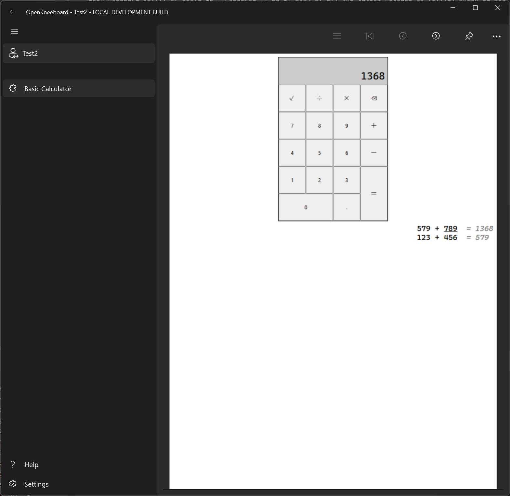

# OpenKneeboard Calculator

This is a basic calculator for [OpenKneeboard](https://openkneeboard.com); it also serves as a sample OpenKneeboard plugin.

OpenKneeboard v1.9.9 or above is **required**; as of 2024-09-19, the latest release is v1.9.8, which is not capable of running this plugin.

## Installation

1. Install a new enough version of OpenKneeboard; as of 2024-09-19, this requires a development build of OpenKneeboard
2. Download `Calculator.OpenKneeboardPlugin` from [the latest release](https://github.com/OpenKneeboard/calculator/releases/latest)
3. Double-click it to launch the plugin installer in OpenKneeboard

## Usage

The buttons can be interacted with via a graphics tablet; OpenKneeboard has no keyboard input support; you can also tap on any number in the history to recall that value (like an 'MR' button, but more powerful).

This plugin works like an "Endless Notebook" tab: the first time you use the calculator, a new, blank page with a blank calculator and history will be added. This lets you switch between several different sets of calculations easily.

## License

This project is [MIT licensed](LICENSE).

## Contributing

While contributions are welcome, please keep in mind that this is meant to be:

- a basic calculator
- a simple sample plugin for OpenKneeboard developers

This leads to some rules for this project that probably aren't the right choice for larger projects:

- advanced features will not be added
- no build systems or transpilers will be used, e.g. TypeScript, WebPack etc
- no external dependencies; no npm

Please contribute via GitHub issues/pull requests, or via `#code-talk` [on Discord](https://go.openkneeboard.com/discord).